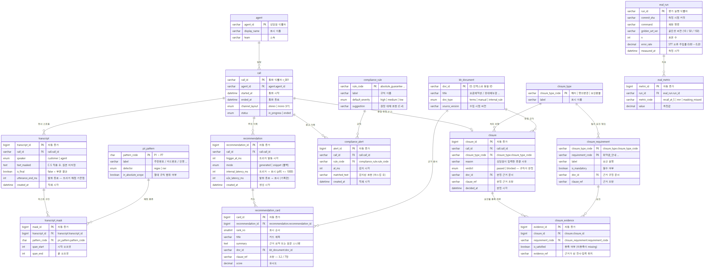

# 시스템 아키텍처 — 기술 문서

> 이 문서는 **구현자용 기술 문서**다. 제안서 서술은 사이트의
> [시스템 아키텍처](https://call.solidbob.cloud/docs/architecture/) 페이지에 있고, 여기에는
> 데이터 모델·재현 절차처럼 코드를 만지는 사람에게 필요한 내용을 둔다.
>
> 기준: 기획서 rev.4 3절 + 인터페이스 계약 3종. 정본 기획서는 `_project/plan.md`.

## 구성

```
[상담원 브라우저]  React 대시보드 (자막 / 카드 / 경고 / 종결 모달)
       │  WebSocket (양방향)
[Node.js 게이트웨이]   오디오 청크 중계 / 자막·카드·경고 푸시
       ├──→ [Google STT] ──→ 부분 전사 결과
       ▼
[FastAPI 코어]
       ├─ C-5 마스킹 모듈 ──→ 자막·저장 양쪽 앞단
       ├─ 트리거 판정 모듈
       ├─ 검색 모듈 ──→ [Elasticsearch]  nori(BM25) + dense_vector + RRF
       ├─ 생성 모듈 ──→ [HF Transformers]  (폴백 시 생략)
       ├─ 컴플라이언스 모듈 ──→ [분류기]
       └─ F-2 게이트 모듈 ──→ 같은 ES 인덱스 조회 + 규칙 판정
       ▼
   [MySQL]  call / transcript / recommendation / closure / eval_result
```

## 데이터 모델 (ERD)

| 파일 | 내용 |
|---|---|
| `docs/erd/schema.mmd` | **Mermaid 소스 — 정본.** 스키마가 바뀌면 이 파일을 고친다 |
| `docs/erd/schema.png` | 시각화 산출물. 소스를 고치면 반드시 다시 생성한다 |
| `docs/erd/mmd-config.json` | 렌더 설정 (한글 글꼴 지정) |
| `docs/erd/normalization.md` | **정규화 기록** — 초안의 정규형 위반과 분해 근거 |



기획서 rev.4 3절이 정한 것은 테이블 5종의 **이름과 한 줄 설명뿐**이다. 컬럼·타입·관계는 인터페이스 계약(7.3절)에서 유도하거나 추론한 것이고, 여기에 **3NF 정규화를 적용해 16개 테이블로 분해**했다. 근거는 `normalization.md`.

| 묶음 | 테이블 | 역할 |
|---|---|---|
| 통화 | `call`, `agent` | 통화 메타. `channel_layout`(stereo/mono)은 V1 확인 대상 |
| 전사 | `transcript`, `transcript_mask`, `pii_pattern` | **마스킹된** 전사. 원본 미저장. `utterance_end_ms`가 트리거 채점 기준점. 마스킹 구간이 행으로 남아 재현율 곡선을 SQL로 집계할 수 있다 |
| 추천 | `recommendation`, `recommendation_card`, `kb_document` | `mode`로 생성/폴백 구분, 레이턴시 2종 각각 기록. 카드가 행이라 출처별 집계가 가능하다 |
| 컴플라이언스 | `compliance_rule`, `compliance_alert` | 규칙 마스터 + 감지 이력. 권장 대체 표현(C-4)은 규칙에 종속 |
| 종결 (F-2) | `closure`, `closure_type`, `closure_requirement`, `closure_evidence` | `closure_requirement`가 **게이트의 판정 기준표**. 판정 로직이 코드가 아니라 데이터로 표현된다 |
| 평가 | `eval_run`, `eval_metric` | 실행 단위 속성(커밋·명령·표본 수)과 지표 값을 분리 |

**미확정**: 컴플라이언스 경고를 별도 테이블로 둘지 `recommendation`에 통합할지는 아직 결정 사항이다(OI-13).
정규화 관점에서는 **별도 테이블을 권고**한다 — 생명주기와 카디널리티가 다르고, 통합하면 NULL이 대량으로 생긴다.
1주차 스키마 회의에서 확정한다.

**적용 순서**: 16개를 한 번에 만들지 않는다. 3주차 코어(`call`·`transcript`·`transcript_mask`·`pii_pattern`), 추천 계열, 1주차 평가 계열(`eval_run`·`eval_metric`) 순으로 만들고, 종결 계열은 F-2가 7주차 체크포인트를 통과할 때 만든다. 상세는 `normalization.md` 6절.

## ERD 재생성

```bash
cd docs/erd
npx -y @mermaid-js/mermaid-cli@11 -i schema.mmd -o schema.png -b white -w 2400 -c mmd-config.json
```

⚠ **한글 폰트가 없는 환경에서 렌더하면 한글이 전부 네모로 나온다.** mermaid-cli는 헤드리스 Chromium을
쓰는데 리눅스 최소 환경에는 한글 글꼴이 없다. WSL이라면 Windows 폰트를 빌려 쓸 수 있다.

```bash
mkdir -p ~/.local/share/fonts
cp /mnt/c/Windows/Fonts/malgun.ttf /mnt/c/Windows/Fonts/malgunbd.ttf ~/.local/share/fonts/
fc-cache -f && fc-list :lang=ko    # 목록에 뜨면 준비 완료
```

리눅스 서버라면 `fonts-noto-cjk`로 대체한다. 렌더 후에는 **이미지를 열어 한글이 깨지지 않았는지 눈으로 확인한다.**

## 관련 문서

| 문서 | 위치 |
|---|---|
| 인터페이스 계약 (전사·카드·종결 3종) | `jekyll/_docs/interface-contract.md` |
| 평가 설계·지표 | `jekyll/_docs/evaluation.md` |
| 기획서 원본 (비공개) | `_project/plan.md` |
